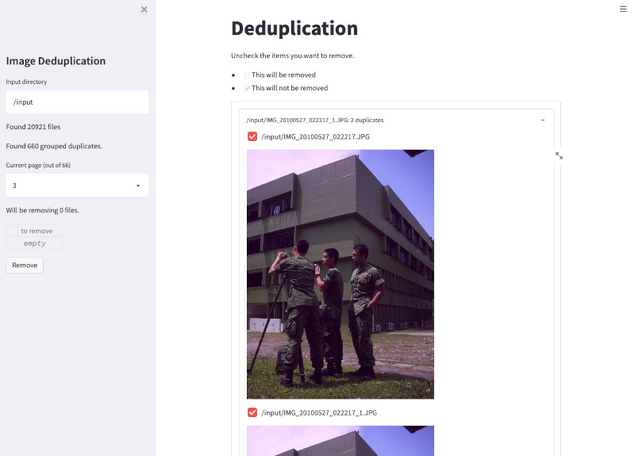

# Image Deduplication
Deduplicate your photos using perceptual hashing.

Just run `docker-compose up` and then navigate to [localhost:8501](http://localhost:8501).
If you want to attach a local volume, just make the change on [docker-compose.yaml](docker-compose.yaml), replacing `C:/photo/tchen-icloud` with whatever you want.

## Notes
Failed on synology with some weird error code - likely due to no AVX.
